# Complete Guide to Bayesian Classification Methods
## Bayes Classifier, LDA, QDA, and Naive Bayes

**Course:** Machine Learning II - BHT Berlin
**Based on:** Prof. Dr. Steffen Wagner's Lectures

---

## Table of Contents

1. [Part 1: Foundation - What is Classification?](#part-1-foundation---what-is-classification)
   - 1.1 Regression vs Classification
   - 1.2 The Bayes Classifier - The Theoretical Ideal
   - 1.3 Bayes' Theorem - The Key Formula
   - 1.4 Bayes Error Rate

2. [Part 2: Linear Discriminant Analysis (LDA)](#part-2-linear-discriminant-analysis-lda)
   - 2.1 What is LDA?
   - 2.2 Complete Example: Classifying Student Sex by Height
   - 2.3 LDA with Multiple Predictor Variables (p ≥ 2)
   - 2.4 Why is the Decision Boundary Linear?
   - 2.5 LDA Algorithm Output
   - 2.6 LDA with More Than Two Classes (K > 2)

3. [Part 3: Quadratic Discriminant Analysis (QDA)](#part-3-quadratic-discriminant-analysis-qda)
   - 3.1 What's Different from LDA?
   - 3.2 Key Consequence
   - 3.3 When to Use QDA vs LDA?

4. [Part 4: Conditional Independence](#part-4-conditional-independence)
   - 4.1 Review: Independence
   - 4.2 Conditional Independence
   - 4.3 Example 1: BHT Students
   - 4.4 Example 2: Smoking and Heart Attack

5. [Part 5: Naive Bayes Classifier](#part-5-naive-bayes-classifier)
   - 5.1 The Core Idea
   - 5.2 Why "Naive"?
   - 5.3 The Naive Bayes Formula
   - 5.4 Why This Simplification Helps
   - 5.5 Fitting a Naive Bayes Classifier
   - 5.6 Case 1: Categorical Predictor Variables
   - 5.7 Case 2: Continuous Predictor Variables
   - 5.8 Complete Naive Bayes Example
   - 5.9 Is the Naive Assumption a Problem?

6. [Part 6: Comparison of Methods](#part-6-comparison-of-methods)
7. [Part 7: Advantages and Disadvantages](#part-7-advantages-and-disadvantages)
8. [Part 8: Glossary of Key Terms](#part-8-glossary-of-key-terms)
9. [Part 9: Practice Problems](#part-9-practice-problems)
10. [Part 10: Key Takeaways](#part-10-key-takeaways)
11. [Part 11: Quick Reference Card](#part-11-quick-reference-card)

---

# Part 1: Foundation - What is Classification?

## 1.1 Regression vs Classification

Before diving into classifiers, let's understand the difference:

| Type | Outcome Variable Y | Example |
|------|-------------------|---------|
| **Regression** | Numeric/Continuous | Predicting house price (€150,000) |
| **Classification** | Categorical/Discrete | Predicting if email is spam (Yes/No) |

**Key insight:** In classification, we predict which *category* or *class* an observation belongs to.

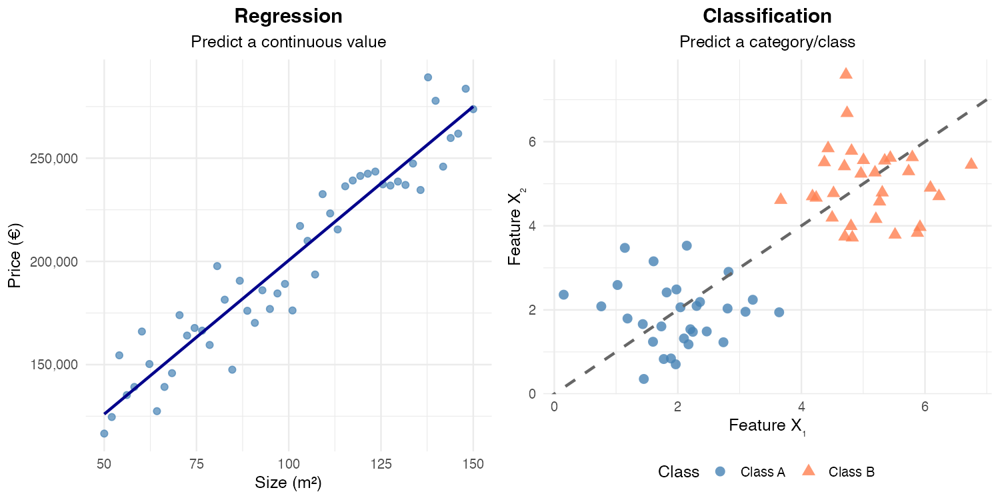

*Figure 1: Regression predicts continuous values (left), while classification predicts discrete categories (right).*

---

## 1.2 The Bayes Classifier - The Theoretical Ideal

### What is it?

The Bayes Classifier is a **theoretical ideal** - the best possible classifier we could have if we knew the true underlying probabilities.

### The Setup

- We have **K possible classes**: y₁, y₂, ..., yₖ
- **Y** is our outcome variable (the class we want to predict)
- **x₁, x₂, ..., xₚ** are our predictor variables (features)

### The Decision Rule

> **Bayes Classifier Rule:** Assign Y to the class yₖ that **maximizes the posterior probability**:
>
> P(Y = yₖ | x₁, ..., xₚ) for all k = 1, ..., K

In plain English: *"Given what we observe (the x values), which class is most likely?"*

### Special Case: Binary Classification (K = 2)

When we only have two classes (like spam/not spam, or male/female):

> Assign Y to class y₂ if: **P(Y = y₂ | x₁, ..., xₚ) > 0.5**

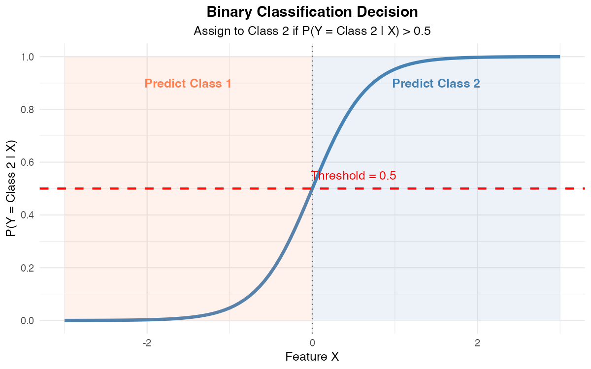

*Figure 2: For binary classification, we predict Class 2 when P(Y = Class 2 | X) exceeds 0.5.*

---

## 1.3 Bayes' Theorem - The Key Formula

Bayes' Theorem allows us to **reverse the direction of conditioning**:

$$P(Y = k | X = x) = \frac{P(X = x | Y = k) \cdot P(Y = k)}{P(X = x)}$$

Let's break this down:

| Term | Name | Meaning |
|------|------|---------|
| P(Y = k \| X = x) | **Posterior** | Probability of class k *after* seeing the data |
| P(X = x \| Y = k) | **Likelihood** | How likely is this data *if* we're in class k |
| P(Y = k) | **Prior** | Probability of class k *before* seeing any data |
| P(X = x) | **Evidence** | Overall probability of seeing this data |

**Visual Summary of Bayes' Theorem:**

```
┌─────────────────────────────────────────────────────┐
│                                                     │
│   POSTERIOR = (LIKELIHOOD × PRIOR) / EVIDENCE      │
│                                                     │
│   P(Y=k|X) = P(X|Y=k) × P(Y=k) / P(X)              │
│                                                     │
└─────────────────────────────────────────────────────┘

    ┌──────────┐        ┌──────────┐        ┌──────────┐
    │  PRIOR   │   →    │ OBSERVE  │   →    │POSTERIOR │
    │ P(Y=k)   │        │   DATA   │        │P(Y=k|X)  │
    │          │        │    X     │        │          │
    │ "Before" │        │          │        │ "After"  │
    └──────────┘        └──────────┘        └──────────┘
```

### The Proportionality Trick

Since the denominator P(X = x) doesn't depend on k, we can write:

$$P(Y = k | X = x) \propto P(X = x | Y = k) \cdot P(Y = k)$$

This means: **posterior ∝ likelihood × prior**

To find actual probabilities, we compute f(k) = P(X=x|Y=k) · P(Y=k) for every class, then:

$$P(Y = k | X = x) = \frac{f(k)}{\sum_j f(j)}$$

---

## 1.4 Bayes Error Rate

The **Bayes error rate** measures the theoretical minimum error we can achieve:

$$\text{Bayes Error Rate} = 1 - E\left[\max_k P(Y = y_k | X)\right]$$

**Interpretation:** Even the perfect Bayes classifier makes some errors when classes overlap.

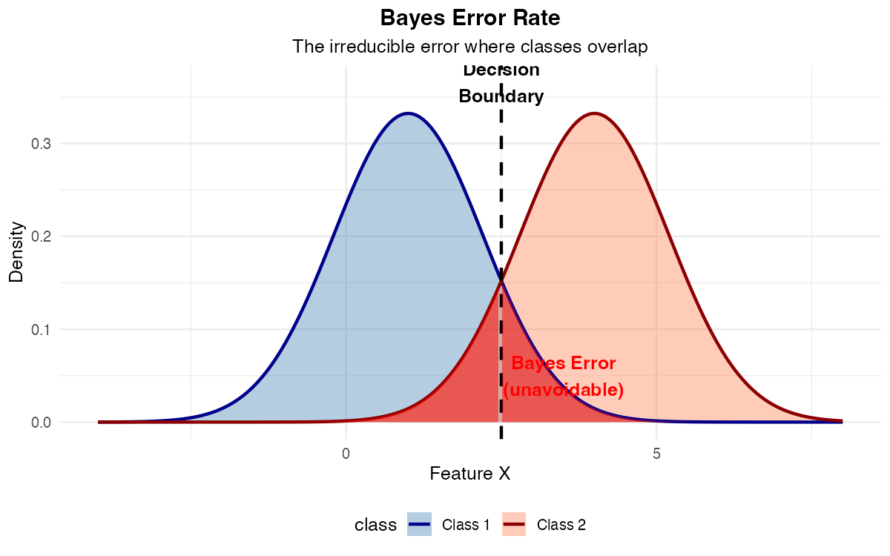

*Figure 3: The Bayes error (shaded red) represents irreducible misclassification where class distributions overlap.*

---

# Part 2: Linear Discriminant Analysis (LDA)

## 2.1 What is LDA?

LDA is a **practical algorithm** to approximate the Bayes classifier by making specific assumptions about the data.

### Key Assumptions

1. **Normal distribution:** The predictor X follows a normal distribution within each class
2. **Equal variance:** The variance σ² is the **same** in all classes (only the means differ)

$$X | Y = k \sim N(\mu_k, \sigma^2)$$

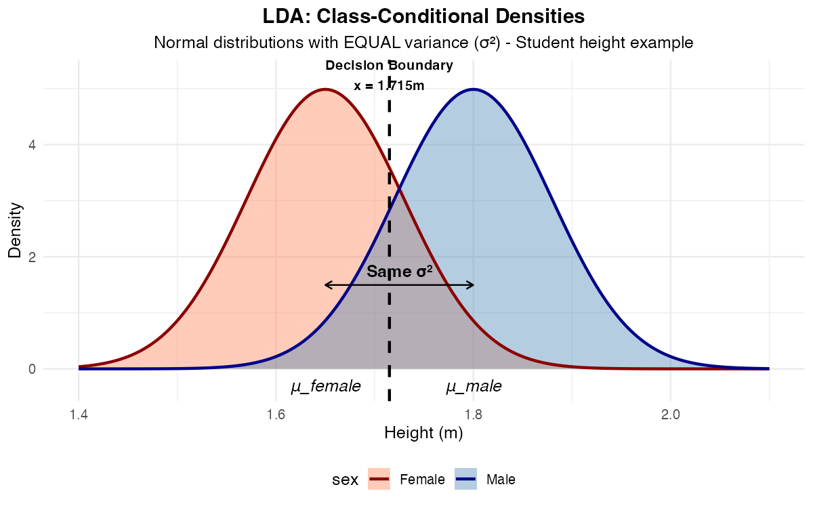

*Figure 4: LDA assumes normal distributions with equal variance (σ²) for each class. The decision boundary occurs where the densities (weighted by priors) are equal.*

---

## 2.2 Complete Example: Classifying Student Sex by Height

### The Setup

We have data from 57 students with:
- **X** = height (predictor)
- **Y** = sex (male or female)

We model:
- X | male ~ N(μₘ, σ²)
- X | female ~ N(μf, σ²)

### Step 1: Define the Prior Probability

Let π₀ = P(Y = male) be the prior probability.

- For general population: π₀ = 0.5
- For engineering students (in the dataset): π₀ = 0.66 (⅔ were male)

### Step 2: Apply Bayes' Theorem

The posterior probability that a person with height x is male:

$$\pi_1(x) := P(\text{male} | x) = \frac{P(x | \text{male}) \cdot P(\text{male})}{P(x | \text{male}) \cdot P(\text{male}) + P(x | \text{female}) \cdot P(\text{female})}$$

$$= \frac{P(x | \text{male}) \cdot \pi_0}{P(x | \text{male}) \cdot \pi_0 + P(x | \text{female}) \cdot (1 - \pi_0)}$$

### Step 3: Use the Normal Distribution Density

For continuous X, we use the density function:

$$P(x | \text{male}) = f_{X|m}(x) = \frac{1}{\sqrt{2\pi\sigma^2}} \exp\left(-\frac{(x - \mu_m)^2}{2\sigma^2}\right)$$

### Step 4: Full Posterior Formula

$$\pi_1(x) = \frac{\frac{\pi_0}{\sqrt{2\pi\sigma^2}} \exp\left(-\frac{(x - \mu_m)^2}{2\sigma^2}\right)}{\frac{\pi_0}{\sqrt{2\pi\sigma^2}} \exp\left(-\frac{(x - \mu_m)^2}{2\sigma^2}\right) + \frac{1 - \pi_0}{\sqrt{2\pi\sigma^2}} \exp\left(-\frac{(x - \mu_f)^2}{2\sigma^2}\right)}$$

### Step 5: Parameter Estimation

In practice:
- **π₀** = proportion of males in the dataset
- **μₘ** = sample mean height of males
- **μf** = sample mean height of females
- **σ²** = variance of mean-corrected heights (pooled from both groups)

### Step 6: Make Classification

**Result:** For x > 1.715m, we have π₁(x) > 0.5, so predict "male"

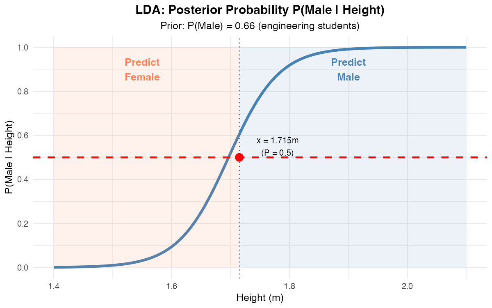

*Figure 5: The posterior probability P(Male | Height) crosses 0.5 at x = 1.715m, defining the decision boundary.*

---

## 2.3 LDA with Multiple Predictor Variables (p ≥ 2)

When we have multiple features (like height AND weight):

$$(\mathbf{X}_1, X_2, ..., X_p) | Y = y_k \sim N(\boldsymbol{\mu}_k, \boldsymbol{\Sigma})$$

Where:
- **μₖ** is a vector of length p (mean for each variable in class k)
- **Σ** is the **common** variance-covariance matrix (same for all classes)

### Example with 2 Variables

Given:
- Group Y=1: μ₁ = (2.2, 13.5)ᵀ
- Group Y=2: μ₂ = (3.9, 11.8)ᵀ
- Covariance matrix: Σ = [[1, 0.5], [0.5, 1]]
- Prior: π₀ = 0.5

The **decision boundary** between classes is **linear** (a straight line in 2D, a hyperplane in higher dimensions).

This is why it's called **Linear** Discriminant Analysis!

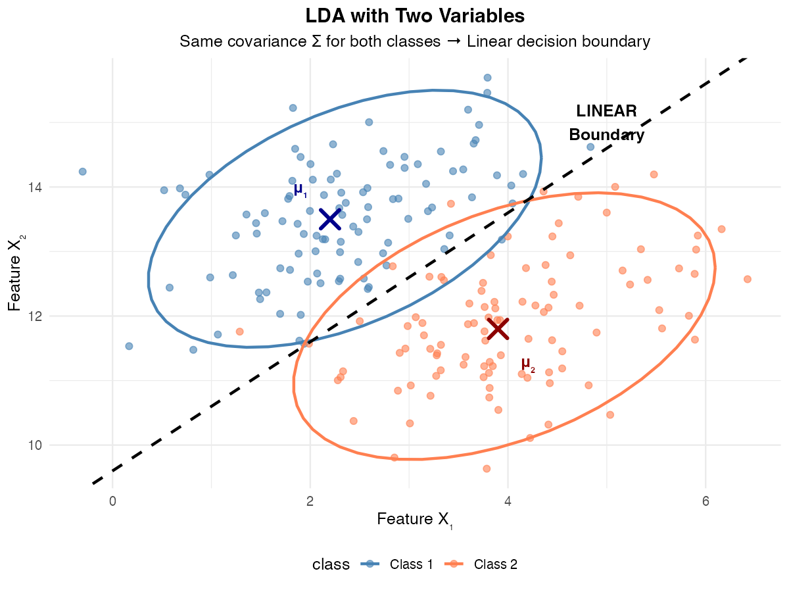

*Figure 6: With two features and equal covariance, LDA produces a linear (straight) decision boundary.*

---

## 2.4 Why is the Decision Boundary Linear?

This is a key question addressed in the course slides (Topic 3, p.15). The answer comes from the mathematics of comparing posterior probabilities.

### The Mathematical Explanation

When we compare two classes using the log-odds (log of posterior ratio):

$$\log\left(\frac{P(Y = k | X)}{P(Y = l | X)}\right) = \log\left(\frac{P(X|Y=k) \cdot P(Y=k)}{P(X|Y=l) \cdot P(Y=l)}\right)$$

For normal distributions with **equal covariance** Σ, when we substitute the multivariate normal density and simplify:

$$= \log\left(\frac{P(Y=k)}{P(Y=l)}\right) + \mu_k^T \Sigma^{-1} x - \frac{1}{2}\mu_k^T \Sigma^{-1} \mu_k - \mu_l^T \Sigma^{-1} x + \frac{1}{2}\mu_l^T \Sigma^{-1} \mu_l$$

### Key Insight: The Quadratic Terms Cancel!

The crucial observation is that the **quadratic terms** in x (the terms with x^T Σ^{-1} x) **cancel out** because both classes share the same covariance matrix Σ.

What remains is:
$$= a_0 + a_1 x_1 + a_2 x_2 + ... + a_p x_p$$

This is a **linear function** of x!

### Why This Matters

- The decision boundary is where P(Y = k | X) = P(Y = l | X)
- This occurs when the log-odds equals zero
- Since log-odds is linear in x, setting it to zero gives a linear equation
- A linear equation in p dimensions defines a **hyperplane** (a line in 2D, a plane in 3D, etc.)

**Visual Summary:**

```
LDA (same Σ):                       QDA (different Σ):

  P(k|x)     P(l|x)                   P(k|x)     P(l|x)
    │           │                       │           │
    ▼           ▼                       ▼           ▼
┌─────────────────────┐           ┌─────────────────────┐
│  x^T Σ^{-1} x       │           │  x^T Σ_k^{-1} x     │
│  (same for both!)   │           │  (DIFFERENT!)       │
└─────────────────────┘           └─────────────────────┘
         │                                  │
         ▼                                  ▼
   Quadratic terms                   Quadratic terms
   CANCEL in ratio                   DO NOT cancel
         │                                  │
         ▼                                  ▼
   LINEAR boundary                  QUADRATIC boundary
```

---

## 2.5 LDA Algorithm Output

LDA produces a **linear discriminant function** (score):

$$\text{score} = \beta_1 \cdot x_1 + \beta_2 \cdot x_2 + ... + \beta_p \cdot x_p$$

**Example from student data (height + weight):**

$$\text{score} = -4.56 \cdot \text{height} - 0.086 \cdot \text{weight}$$

Classification rule: Predict male if score > cutoff (e.g., -13.6)

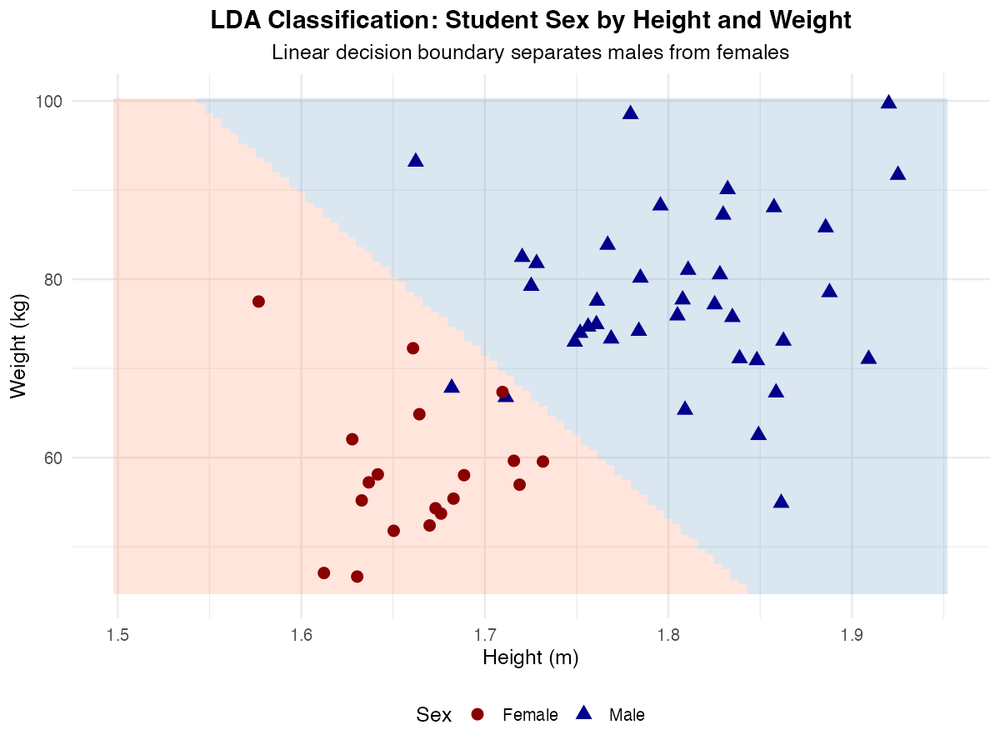

*Figure 7: LDA classification of students by height and weight, showing the linear decision boundary.*

---

## 2.6 LDA with More Than Two Classes (K > 2)

LDA extends easily to K > 2 classes:

$$P(Y = y_k | x) = \frac{f_{X|y_k}(x) \cdot P(Y = y_k)}{\sum_{j=1}^{K} f_{X|y_j}(x) \cdot P(Y = y_j)}$$

**Example: Berlin Rent Zones**

Predicting BVG Zone (A, B, or C) based on rent per square meter:
- Zone A (center): Higher rent areas
- Zone B (middle): Medium rent areas
- Zone C (outer): Lower rent areas

The class-conditional densities show how rent distributions differ by zone:

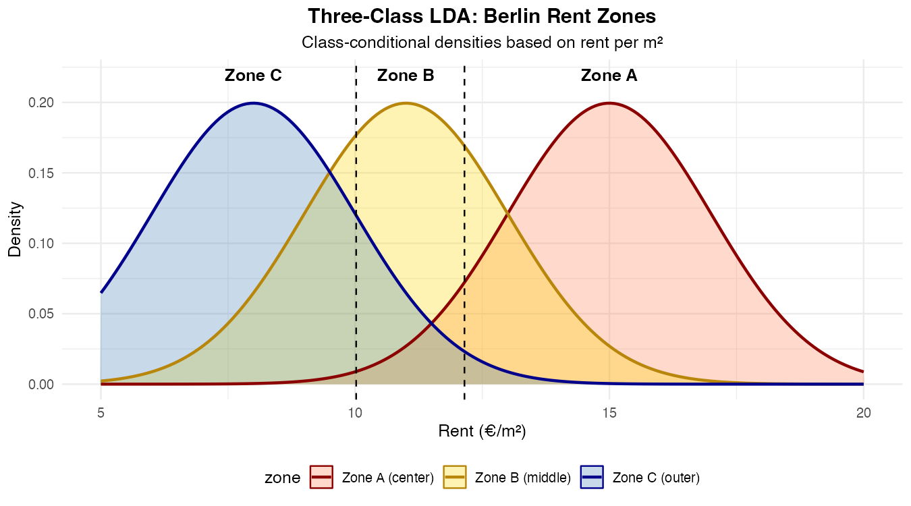

*Figure 8: Three-class LDA for Berlin rent zones showing class-conditional densities. Each zone has a different mean rent.*

From these densities, we compute the **posterior probabilities** P(Zone | Rent) using Bayes' theorem:

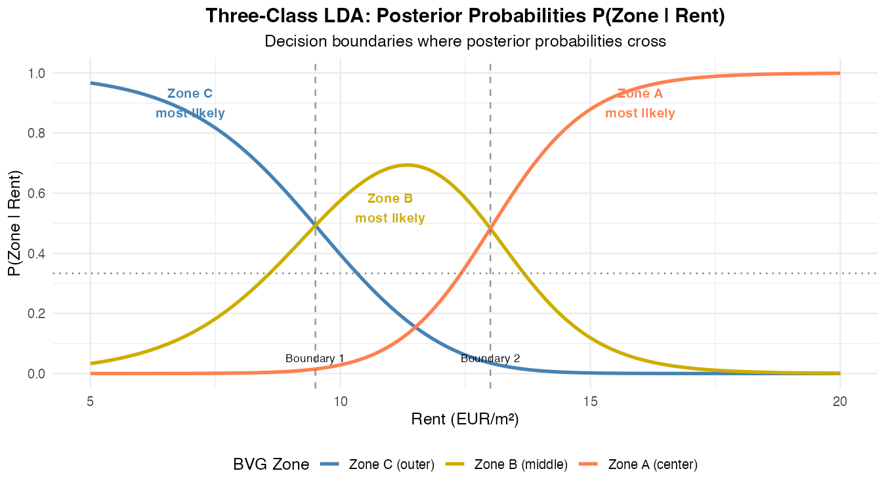

*Figure 8b: Posterior probabilities for each zone given observed rent. The decision boundaries occur where the curves cross - we predict the zone with highest posterior probability.*

**Key observations from the posterior plot:**
- At low rents (< ~9.5€/m²): Zone C has highest posterior → predict Zone C
- At medium rents (~9.5-13€/m²): Zone B has highest posterior → predict Zone B
- At high rents (> ~13€/m²): Zone A has highest posterior → predict Zone A
- The decision boundaries are where posterior probabilities are equal

---

# Part 3: Quadratic Discriminant Analysis (QDA)

## 3.1 What's Different from LDA?

**LDA assumes:** Same covariance matrix Σ for all classes

**QDA relaxes this:** Each class can have its **own** covariance matrix Σₖ

$$(\mathbf{X}_1, X_2, ..., X_p) | Y = y_k \sim N(\boldsymbol{\mu}_k, \boldsymbol{\Sigma}_k)$$

## 3.2 Key Consequence

Because the covariance matrices differ, the decision boundary becomes **curved** (quadratic), not linear.

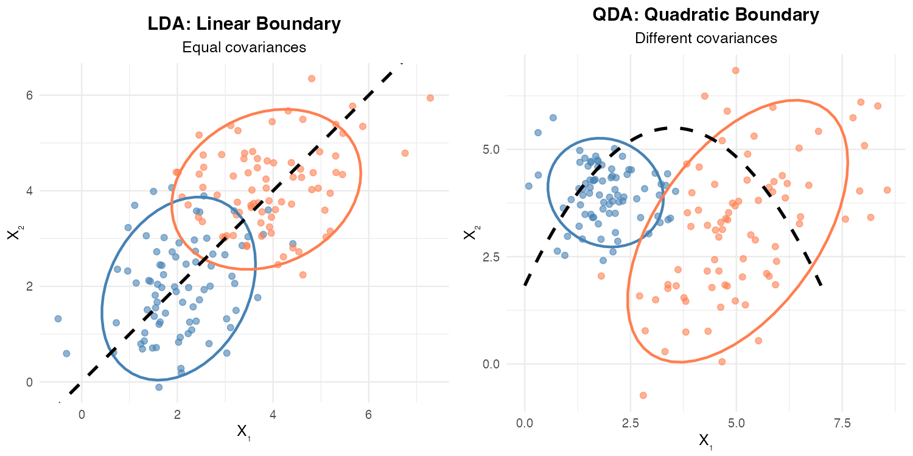

*Figure 9: LDA produces linear boundaries (left), while QDA produces curved/quadratic boundaries (right) when classes have different covariances.*

**Why QDA Boundaries Are Curved:**

When classes have different spreads/shapes (different covariance matrices), the boundary must curve to properly separate them. A small, tight cluster needs different treatment than a large, spread-out cluster.

## 3.3 When to Use QDA vs LDA?

| Use LDA when... | Use QDA when... |
|-----------------|-----------------|
| Classes have similar spread/shape | Classes have different spreads |
| Limited training data | Plenty of training data |
| Want simpler model | Flexibility is more important |

**Note:** QDA has more parameters to estimate, so it needs more data.

---

# Part 4: Conditional Independence

## 4.1 Review: Independence

Two events X₁ and X₂ are **independent** when:

$$P(X_1 | X_2) = P(X_1)$$

**Interpretation:** "Knowing X₂ doesn't change our belief about X₁"

Equivalently:
$$P(X_1 \cap X_2) = P(X_1) \cdot P(X_2)$$

**Example:** Rolling a six on a die and you passing Machine Learning II are (should be!) independent events.

---

## 4.2 Conditional Independence

X₁ and X₂ are **conditionally independent given Y** when:

$$P(X_1 | Y, X_2) = P(X_1 | Y)$$

**Interpretation:** "If we know Y, then knowing X₂ doesn't give us any additional information about X₁"

Equivalently:
$$P(X_1 \cap X_2 | Y) = P(X_1 | Y) \cdot P(X_2 | Y)$$

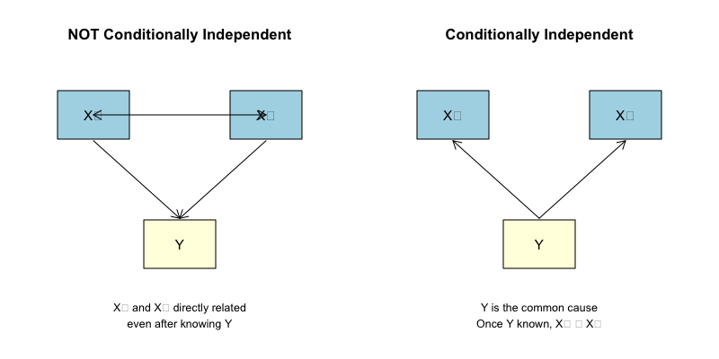

*Figure 10: Left - X₁ and X₂ remain related even after knowing Y. Right - Once Y is known, X₁ and X₂ become independent (Y is the common cause).*

---

## 4.3 Example 1: BHT Students (from slides)

Consider these events for a randomly chosen BHT student:
- **X₁:** Studies Statistical Computing
- **X₂:** Studies Computer Science for Big Data
- **Y:** Is a 1st semester Data Science Masters Student

**Are X₁ and X₂ independent?**

No! P(X₁ | X₂) > P(X₁) because both courses are taken by similar students.

**Are X₁ and X₂ conditionally independent given Y?**

Yes (probably)! Once we know the student is a 1st semester Data Science student (Y), knowing they take one course doesn't tell us more about the other - Y "causes" both X₁ and X₂.

$$P(X_1 | Y, X_2) = P(X_1 | Y)$$

---

## 4.4 Example 2: Smoking and Heart Attack (from slides)

- **X₁:** Person is a regular smoker
- **Y:** Person has high blood pressure
- **X₂:** Person suffers a heart attack

X₁ and X₂ are **not independent** (smoking is associated with heart attacks).

But they are **conditionally independent given Y** because:
- X₁ "causes" Y (smoking causes high blood pressure)
- Y "causes" X₂ (high blood pressure causes heart attacks)

Once we know blood pressure status, smoking doesn't give additional information about heart attack risk (beyond what blood pressure tells us).

**Causal Chain Diagram:**

```
┌──────────┐         ┌──────────────┐         ┌─────────────┐
│ SMOKING  │ ──────→ │ HIGH BLOOD   │ ──────→ │ HEART       │
│   (X₁)   │         │ PRESSURE (Y) │         │ ATTACK (X₂) │
└──────────┘         └──────────────┘         └─────────────┘

X₁ and X₂ are NOT independent (smoking → heart attack)

But given Y (blood pressure known):
Once we know blood pressure, smoking gives no ADDITIONAL
information about heart attack risk.

X₁ ⊥ X₂ | Y  (Conditionally independent)
```

---

# Part 5: Naive Bayes Classifier

## 5.1 The Core Idea

The Naive Bayes classifier makes a **strong simplifying assumption**:

> **Naive Bayes Assumption:** All predictor variables are **conditionally independent** given the class Y.

This means: Once we know the class, each feature provides independent information.

---

## 5.2 Why "Naive"?

It's called "naive" because conditional independence rarely holds perfectly in real data. For example:
- Height and weight are correlated (tall people tend to weigh more)
- But Naive Bayes treats them as independent given the class

Despite this "naive" assumption, the classifier often works surprisingly well!

**The "Naive" Assumption Illustrated:**

```
Reality:                              Naive Bayes Assumes:

    Height ←────────→ Weight              Height      Weight
        \           /                        │           │
         \         /                         │           │
          \       /                          ↓           ↓
           ↓     ↓                          ┌─────────────┐
         ┌───────┐                          │    Class    │
         │ Class │                          │   (Male/    │
         │(Male/ │                          │   Female)   │
         │Female)│                          └─────────────┘
         └───────┘
                                       "Given the class, height
    Height and weight                  tells me nothing about
    are correlated                     weight" (NAIVE!)
    even within a class
```

---

## 5.3 The Naive Bayes Formula

Starting with Bayes' Theorem for multiple variables:

$$P(Y = k | x_1, ..., x_p) \propto P(x_1 | Y = k, x_2, ..., x_p) \cdot P(x_2 | Y = k, x_3, ..., x_p) \cdot ... \cdot P(x_p | Y = k) \cdot P(Y = k)$$

With the conditional independence assumption, each term simplifies:

$$P(x_j | Y = k, x_{j+1}, ..., x_p) = P(x_j | Y = k)$$

**Final Naive Bayes Formula:**

$$P(Y = k | x_1, ..., x_p) \propto P(Y = k) \cdot \prod_{j=1}^{p} P(x_j | Y = k)$$

**In words:** posterior ∝ prior × (product of individual likelihoods)

**Formula Breakdown:**

```
┌────────────────────────────────────────────────────────────────┐
│                                                                │
│  P(Class | x₁, x₂, ..., xₚ)  ∝  P(Class) × P(x₁|Class)        │
│                                           × P(x₂|Class)        │
│                                           × P(x₃|Class)        │
│                                           × ...                │
│                                           × P(xₚ|Class)        │
│                                                                │
│  ════════════════════════    ═══════════  ══════════════════   │
│       POSTERIOR                PRIOR        PRODUCT OF         │
│   (what we want)              (easy)      LIKELIHOODS          │
│                                           (each is easy!)      │
│                                                                │
└────────────────────────────────────────────────────────────────┘

WITHOUT Naive assumption:              WITH Naive assumption:
Need: P(x₁|Class, x₂, x₃,...)         Need: P(x₁|Class) only!
      (very hard to estimate)               (easy to estimate)
```

---

## 5.4 Why This Simplification Helps

| Without Naive Bayes | With Naive Bayes |
|---------------------|------------------|
| Need to estimate P(x₁ \| Y=k, x₂, ..., xₚ) | Only estimate P(x₁ \| Y=k) |
| Requires LOTS of data | Requires much less data |
| Curse of dimensionality | Scales well with many features |

---

## 5.5 Fitting a Naive Bayes Classifier

We need to estimate:

1. **Prior P(Y = k):** Easy! Just count relative frequencies of each class.

2. **Likelihood P(xⱼ | Y = k):** Depends on variable type...

---

## 5.6 Case 1: Categorical Predictor Variables

For a categorical variable Xⱼ with values A, B, C, D:

**Estimate P(Xⱼ = A | Y = k)** as the relative frequency of A among observations where Y = k.

### Worked Example (from slides)

| | X | | | | |
|---|---|---|---|---|---|
| | A | B | C | D | Sum |
| Y=Yes | 26 | 27 | 7 | 4 | 64 |
| Y=No | 5 | 5 | 2 | 0 | 12 |
| Sum | 31 | 32 | 9 | 4 | 76 |

**Calculate likelihoods (row proportions):**

| | A | B | C | D |
|---|---|---|---|---|
| Y=Yes | 26/64 = 0.406 | 27/64 = 0.422 | 7/64 = 0.109 | 4/64 = 0.062 |
| Y=No | 5/12 = 0.417 | 5/12 = 0.417 | 2/12 = 0.167 | 0/12 = 0 |

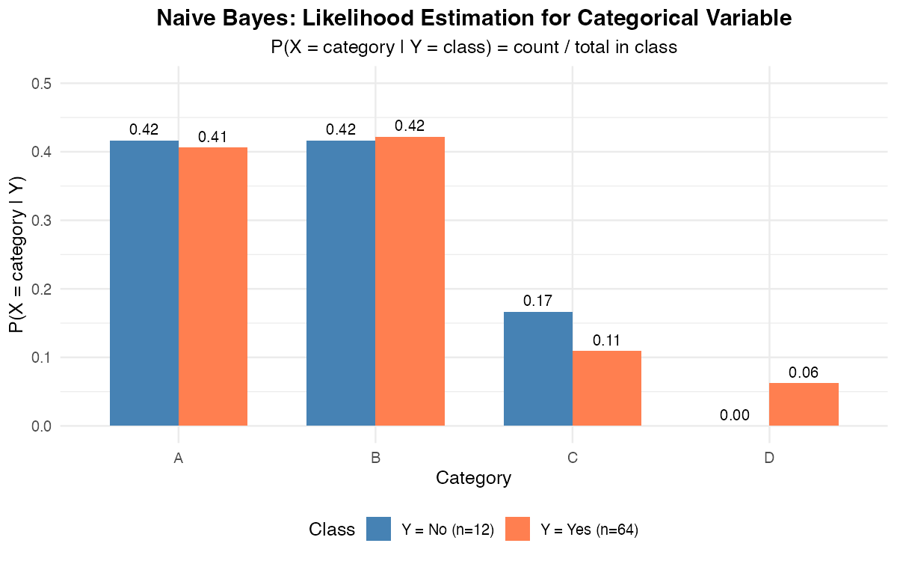

*Figure 11: Likelihood estimation for categorical variables - the proportion of each category within each class.*

**Results:**
- P(X = B | Y = Yes) = 0.422
- P(X = D | Y = No) = 0 (problem! see Laplace smoothing)

---

## 5.7 Case 2: Continuous Predictor Variables

A common approach: Assume normal distribution for each feature within each class.

$$(x_j | Y = k) \sim N(\mu_{jk}, \sigma^2_{jk})$$

**Parameter estimation:**
- **μⱼₖ** = mean of xⱼ for all observations with class k
- **σ²ⱼₖ** = variance of xⱼ for all observations with class k

**Simplification:** Often assume σ²ⱼₖ = σ²ⱼ (same variance across classes)

**Alternative:** Use Kernel Density Estimators for non-parametric density estimation.

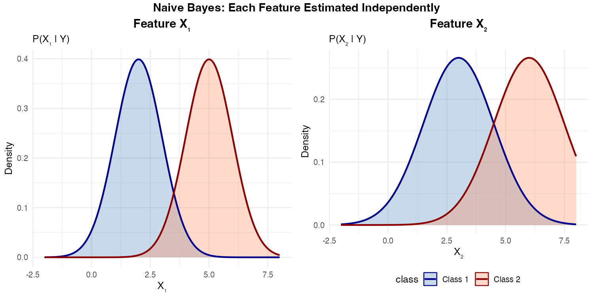

*Figure 12: For continuous features, Naive Bayes estimates separate distributions for each feature independently.*

---

## 5.8 Complete Naive Bayes Example

**Problem:** Classify whether someone plays tennis based on weather conditions.

**Training Data:**

| Outlook | Temperature | Humidity | Wind | Play Tennis |
|---------|-------------|----------|------|-------------|
| Sunny | Hot | High | Weak | No |
| Sunny | Hot | High | Strong | No |
| Overcast | Hot | High | Weak | Yes |
| Rain | Mild | High | Weak | Yes |
| Rain | Cool | Normal | Weak | Yes |
| Rain | Cool | Normal | Strong | No |
| Overcast | Cool | Normal | Strong | Yes |
| Sunny | Mild | High | Weak | No |
| Sunny | Cool | Normal | Weak | Yes |
| Rain | Mild | Normal | Weak | Yes |

**New observation to classify:**
- Outlook = Sunny
- Temperature = Cool
- Humidity = High
- Wind = Strong

**Step 1: Calculate Priors**
- P(Yes) = 6/10 = 0.6
- P(No) = 4/10 = 0.4

**Step 2: Calculate Likelihoods for Each Feature**

*For Play = Yes:*
- P(Sunny | Yes) = 2/6 = 0.333
- P(Cool | Yes) = 2/6 = 0.333
- P(High | Yes) = 2/6 = 0.333
- P(Strong | Yes) = 2/6 = 0.333

*For Play = No:*
- P(Sunny | No) = 3/4 = 0.75
- P(Cool | No) = 1/4 = 0.25
- P(High | No) = 3/4 = 0.75
- P(Strong | No) = 2/4 = 0.5

**Step 3: Apply Naive Bayes Formula**

$$P(\text{Yes} | \text{evidence}) \propto 0.6 \times 0.333 \times 0.333 \times 0.333 \times 0.333 = 0.0074$$

$$P(\text{No} | \text{evidence}) \propto 0.4 \times 0.75 \times 0.25 \times 0.75 \times 0.5 = 0.0281$$

**Step 4: Normalize**

$$P(\text{Yes} | \text{evidence}) = \frac{0.0074}{0.0074 + 0.0281} = 0.21$$

$$P(\text{No} | \text{evidence}) = \frac{0.0281}{0.0074 + 0.0281} = 0.79$$

**Prediction:** Don't play tennis (79% probability)

**Calculation Flow Summary:**

```
Given: Sunny, Cool, High, Strong → Play Tennis?

┌─────────────────────────────────────────┐
│            CALCULATE FOR YES            │
├─────────────────────────────────────────┤
│  Prior:    P(Yes) = 0.6                 │
│  ×                                      │
│  P(Sunny|Yes)  = 0.333                  │
│  ×                                      │
│  P(Cool|Yes)   = 0.333                  │
│  ×                                      │
│  P(High|Yes)   = 0.333                  │
│  ×                                      │
│  P(Strong|Yes) = 0.333                  │
│  ═══════════════════════                │
│  = 0.0074                               │
└─────────────────────────────────────────┘

┌─────────────────────────────────────────┐
│            CALCULATE FOR NO             │
├─────────────────────────────────────────┤
│  Prior:    P(No) = 0.4                  │
│  ×                                      │
│  P(Sunny|No)   = 0.75                   │
│  ×                                      │
│  P(Cool|No)    = 0.25                   │
│  ×                                      │
│  P(High|No)    = 0.75                   │
│  ×                                      │
│  P(Strong|No)  = 0.50                   │
│  ═══════════════════════                │
│  = 0.0281                               │
└─────────────────────────────────────────┘

┌─────────────────────────────────────────┐
│              NORMALIZE                  │
├─────────────────────────────────────────┤
│  P(Yes|evidence) = 0.0074/(0.0074+0.0281)
│                 = 0.21 (21%)            │
│                                         │
│  P(No|evidence)  = 0.0281/(0.0074+0.0281)
│                 = 0.79 (79%)  ← WINNER  │
└─────────────────────────────────────────┘

PREDICTION: NO (Don't play tennis)
```

---

## 5.9 Is the Naive Assumption a Problem?

**Practical argument:** "As long as the results are good, who cares if features are truly conditionally independent?"

**Mathematical justification:**
- The conditional independence assumption may be wrong
- But the *difference* in P(Y=k|x) with vs. without the assumption is usually small
- The class k that maximizes posterior probability is often the same either way
- The resulting classifier is usually not drastically different

---

# Part 6: Comparison of Methods

## 6.1 LDA vs Naive Bayes (from slides)

| Aspect | LDA | Naive Bayes |
|--------|-----|-------------|
| **Likelihood distribution** | Multivariate Normal | Any distribution |
| **Covariance assumption** | Full covariance matrix Σ (allows correlation) | Diagonal matrix (no correlation = conditional independence) |
| **Predictor types** | Must be continuous | Can be mixed (categorical + continuous) |
| **Conditional independence** | No assumption | Assumes conditional independence |

**Key insight:** LDA is like a "non-naive" Bayes with multivariate normal likelihood.

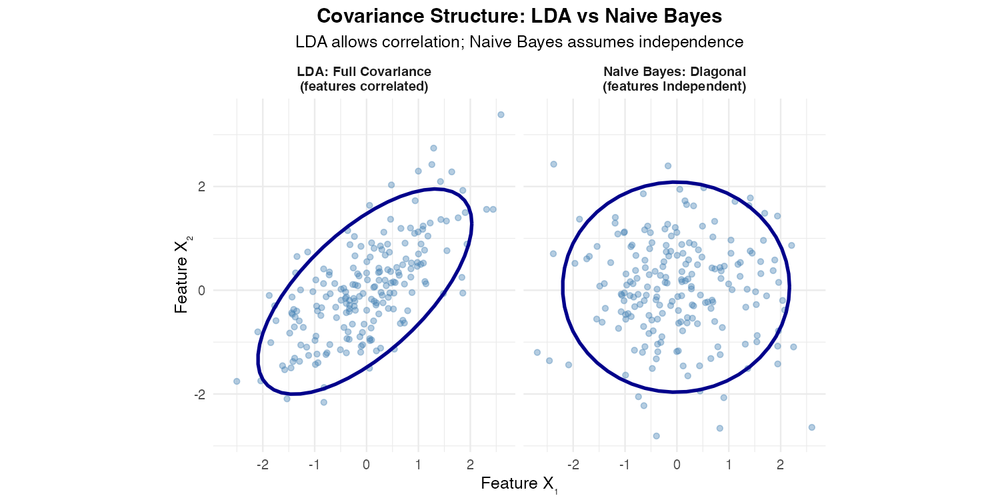

*Figure 13: LDA uses a full covariance matrix (allowing correlation), while Naive Bayes assumes diagonal covariance (independence).*

---

## 6.2 LDA vs QDA

| Aspect | LDA | QDA |
|--------|-----|-----|
| **Covariance** | Same Σ for all classes | Different Σₖ for each class |
| **Decision boundary** | Linear (straight line/plane) | Quadratic (curved) |
| **Parameters to estimate** | Fewer | More |
| **Data requirement** | Less data needed | More data needed |
| **Flexibility** | Less flexible | More flexible |

---

## 6.3 Summary Table

| Method | Distribution Assumption | Independence Assumption | Decision Boundary | Best For |
|--------|------------------------|------------------------|-------------------|----------|
| **LDA** | Multivariate Normal | None (allows correlation) | Linear | Continuous features, similar class spreads |
| **QDA** | Multivariate Normal | None (allows correlation) | Quadratic | Continuous features, different class spreads |
| **Naive Bayes** | Flexible (often Normal or categorical) | Conditional independence | Depends on distributions | Mixed feature types, high-dimensional data |

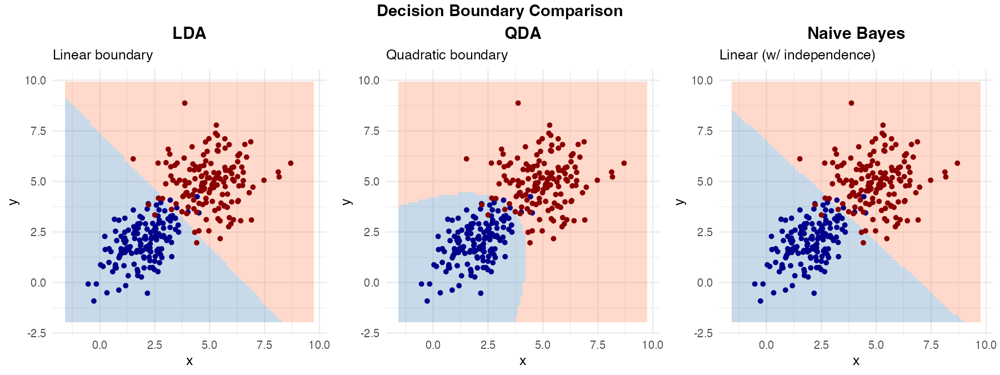

*Figure 14: Comparison of decision boundaries - LDA (linear), QDA (quadratic), and Naive Bayes (linear with independence assumption).*

---

## 6.4 Practical Comparison (Student Data - from slides)

**Task:** Classify student sex

| Method | Features | Sensitivity | Specificity | Misclassified |
|--------|----------|-------------|-------------|---------------|
| LDA | Height only | 0.868 | 0.684 | 11/57 |
| LDA | Height + Weight | 0.947 | 0.736 | 7/57 |
| QDA | Height + Weight | ~same as LDA | ~same as LDA | No improvement |

**Conclusion:** Adding weight improves classification. QDA doesn't help here because the covariances are similar between sexes.

---

# Part 7: Advantages and Disadvantages

## 7.1 Naive Bayes

**Advantages:**
- Very fast algorithm
- Works well with high-dimensional data
- Handles mixed variable types
- Requires relatively little training data
- Good baseline for comparison

**Disadvantages:**
- Conditional independence rarely holds
- No direct way to test if a variable improves the model
- Probability estimates may be poor (even if classifications are good)

---

## 7.2 LDA

**Advantages:**
- Well-founded probabilistic model
- Interpretable coefficients
- Works well when assumptions hold
- Can extract discriminant functions for dimension reduction

**Disadvantages:**
- Requires continuous predictors
- Assumes equal covariances (may not hold)
- Sensitive to outliers
- Assumes normality

---

## 7.3 QDA

**Advantages:**
- More flexible than LDA
- Curved decision boundaries
- Each class has own covariance

**Disadvantages:**
- More parameters = needs more data
- Risk of overfitting with small samples
- Still assumes normality

---

## 7.4 Choosing the Right Method: Decision Guide

```
                         START
                           │
                           ▼
              ┌────────────────────────┐
              │  Are predictors all    │
              │     continuous?        │
              └────────────────────────┘
                    │           │
                   YES          NO
                    │           │
                    ▼           ▼
    ┌──────────────────┐    ┌──────────────────┐
    │ Do classes have  │    │   NAIVE BAYES    │
    │ similar spreads? │    │  (handles mixed) │
    └──────────────────┘    └──────────────────┘
          │         │
         YES        NO
          │         │
          ▼         ▼
    ┌─────────┐ ┌─────────┐
    │   LDA   │ │  QDA or │
    │(simpler)│ │  NB     │
    └─────────┘ └─────────┘
```

---

# Part 8: Glossary of Key Terms

| Term | Definition |
|------|------------|
| **Posterior probability** | P(Y=k\|X) - probability of class k after observing data |
| **Prior probability** | P(Y=k) - probability of class k before seeing data |
| **Likelihood** | P(X\|Y=k) - probability of data given class k |
| **Evidence** | P(X) - overall probability of the observed data |
| **Bayes Classifier** | Theoretical ideal classifier that maximizes posterior probability |
| **Bayes Error Rate** | Minimum achievable error rate |
| **LDA** | Linear Discriminant Analysis - assumes equal covariance |
| **QDA** | Quadratic Discriminant Analysis - allows different covariances |
| **Naive Bayes** | Classifier assuming conditional independence of features |
| **Conditional Independence** | Features are independent once the class is known |
| **Discriminant Function** | Linear combination of features used for classification |
| **Decision Boundary** | The region where classification changes from one class to another |

---

# Part 9: Practice Problems

## Problem 1: Bayes' Theorem

A medical test for a disease has:
- Sensitivity (true positive rate): 95%
- Specificity (true negative rate): 90%
- Disease prevalence: 1%

If a patient tests positive, what's the probability they have the disease?

<details>
<summary>Solution</summary>

Using Bayes' Theorem:
- P(Disease) = 0.01
- P(Positive | Disease) = 0.95
- P(Positive | No Disease) = 0.10

P(Positive) = 0.95 × 0.01 + 0.10 × 0.99 = 0.0095 + 0.099 = 0.1085

P(Disease | Positive) = (0.95 × 0.01) / 0.1085 = 0.0876 ≈ **8.76%**

Despite the positive test, there's only about 9% chance of having the disease!

**Visualization:**

```
Total Population (10,000 people):
┌────────────────────────────────────────────────────────────────┐
│░░░░░░░░░░░░░░░░░░░░░░░░░░░░░░░░░░░░░░░░░░░░░░░░░░░░░░░░░░░░░░░│ 9,900 healthy
│████                                                            │ 100 diseased
└────────────────────────────────────────────────────────────────┘

Test Positive:
- 95 of 100 diseased (true positives)
- 990 of 9,900 healthy (false positives)

P(Disease|Positive) = 95 / (95 + 990) = 8.76%
```
</details>

---

## Problem 2: Naive Bayes with Categorical Variables

Given this training data:

| Color | Size | Shape | Edible |
|-------|------|-------|--------|
| Red | Small | Round | Yes |
| Red | Large | Round | No |
| Yellow | Small | Round | Yes |
| Yellow | Large | Irregular | No |
| Yellow | Small | Round | Yes |
| Red | Large | Irregular | No |

Classify: Color=Yellow, Size=Small, Shape=Irregular

<details>
<summary>Solution</summary>

**Priors:**
- P(Yes) = 3/6 = 0.5
- P(No) = 3/6 = 0.5

**Likelihoods for Yes:**
- P(Yellow | Yes) = 2/3
- P(Small | Yes) = 3/3 = 1
- P(Irregular | Yes) = 0/3 = 0

**Likelihoods for No:**
- P(Yellow | No) = 1/3
- P(Small | No) = 0/3 = 0
- P(Irregular | No) = 2/3

**Problem:** Both have zero probabilities! This is the "zero frequency problem."

**Solution:** Use Laplace smoothing (add 1 to all counts).
</details>

---

## Problem 3: LDA vs QDA

When would you prefer QDA over LDA?

<details>
<summary>Solution</summary>

Prefer QDA when:
1. Classes have clearly different spreads/variances
2. You have enough data to estimate separate covariance matrices
3. The decision boundary appears curved in visualizations
4. LDA is underfitting (too simple)

Prefer LDA when:
1. Limited training data
2. Classes have similar spreads
3. You want a simpler, more interpretable model
4. QDA is overfitting
</details>

---

## Problem 4: Conditional Independence

Are these pairs conditionally independent given Y?

a) X₁ = Age, X₂ = Income, Y = Credit Risk
b) X₁ = Word "free", X₂ = Word "money", Y = Spam

<details>
<summary>Solution</summary>

a) **Probably NOT conditionally independent.** Age affects income even within the same credit risk category. Older people in the "low risk" category still tend to earn more than younger "low risk" people.

b) **Possibly approximately independent.** Given that an email is spam, the presence of "free" might not strongly predict "money" - spammers might use various word combinations. This is why Naive Bayes works reasonably well for spam detection!
</details>

---

# Part 10: Key Takeaways

```
╔════════════════════════════════════════════════════════════════════╗
║                        KEY TAKEAWAYS                               ║
╠════════════════════════════════════════════════════════════════════╣
║                                                                    ║
║  1. BAYES CLASSIFIER = Theoretical ideal (maximize posterior)     ║
║                                                                    ║
║  2. LDA = Practical approximation                                 ║
║           • Assumes multivariate normal                           ║
║           • Same covariance for all classes                       ║
║           • LINEAR decision boundary                              ║
║                                                                    ║
║  3. QDA = More flexible than LDA                                  ║
║           • Different covariance per class                        ║
║           • QUADRATIC (curved) decision boundary                  ║
║           • Needs more data                                       ║
║                                                                    ║
║  4. NAIVE BAYES = Assumes conditional independence                ║
║           • Simplifies computation dramatically                   ║
║           • Works surprisingly well despite "naive" assumption    ║
║           • Handles mixed variable types                          ║
║                                                                    ║
║  5. ALL METHODS use: posterior ∝ likelihood × prior               ║
║                                                                    ║
╚════════════════════════════════════════════════════════════════════╝
```

---

# Part 11: Quick Reference Card

```
┌─────────────────────────────────────────────────────────────────────┐
│                    QUICK REFERENCE CARD                             │
├─────────────────────────────────────────────────────────────────────┤
│                                                                     │
│  BAYES' THEOREM:                                                    │
│  ───────────────                                                    │
│                    P(X|Y=k) · P(Y=k)                                │
│  P(Y=k|X) = ─────────────────────────                               │
│                       P(X)                                          │
│                                                                     │
│  Or simply: posterior ∝ likelihood × prior                         │
│                                                                     │
├─────────────────────────────────────────────────────────────────────┤
│                                                                     │
│  LDA MODEL:                                                         │
│  ──────────                                                         │
│  X|Y=k ~ N(μₖ, Σ)     [Same Σ for all classes]                      │
│                                                                     │
│  QDA MODEL:                                                         │
│  ──────────                                                         │
│  X|Y=k ~ N(μₖ, Σₖ)    [Different Σₖ per class]                      │
│                                                                     │
├─────────────────────────────────────────────────────────────────────┤
│                                                                     │
│  NAIVE BAYES:                                                       │
│  ────────────                                                       │
│  P(Y=k|x₁,...,xₚ) ∝ P(Y=k) · ∏ P(xⱼ|Y=k)                            │
│                               j                                     │
│                                                                     │
│  Assumes: P(xᵢ|Y, xⱼ) = P(xᵢ|Y)  [Conditional independence]        │
│                                                                     │
├─────────────────────────────────────────────────────────────────────┤
│                                                                     │
│  DECISION RULE (all methods):                                       │
│  ────────────────────────────                                       │
│  Classify as class k* = argmax P(Y=k|X)                             │
│                           k                                         │
│                                                                     │
│  For K=2: Classify as class 2 if P(Y=2|X) > 0.5                     │
│                                                                     │
└─────────────────────────────────────────────────────────────────────┘
```

---

# Appendix: Generating the Plots

All plots in this document were generated using R. To regenerate them, run:

```r
source("generate_plots.R")
```

This will create all PNG images in the `images/` folder.

**Required R packages:**
- ggplot2
- gridExtra
- MASS
- grid
