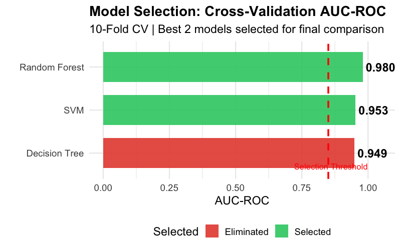
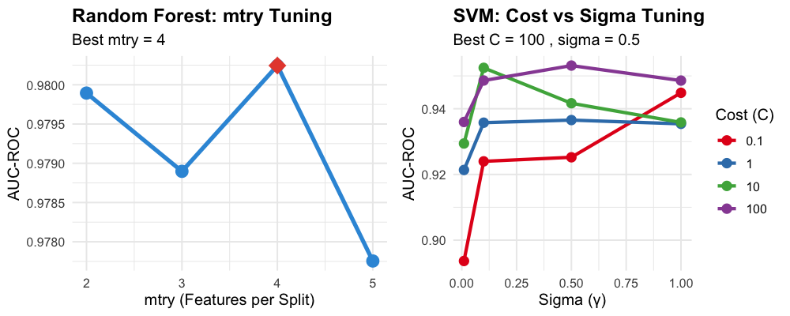
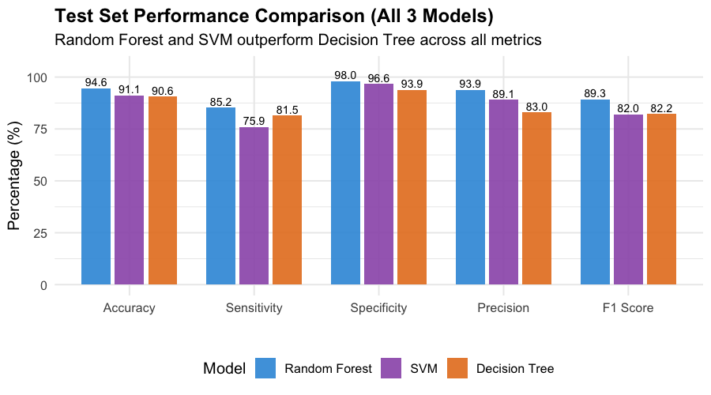
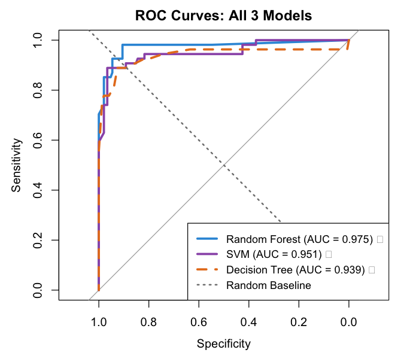
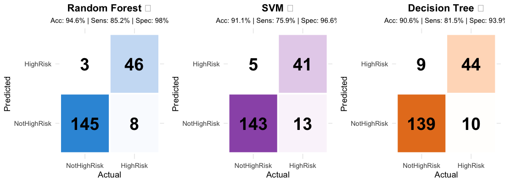
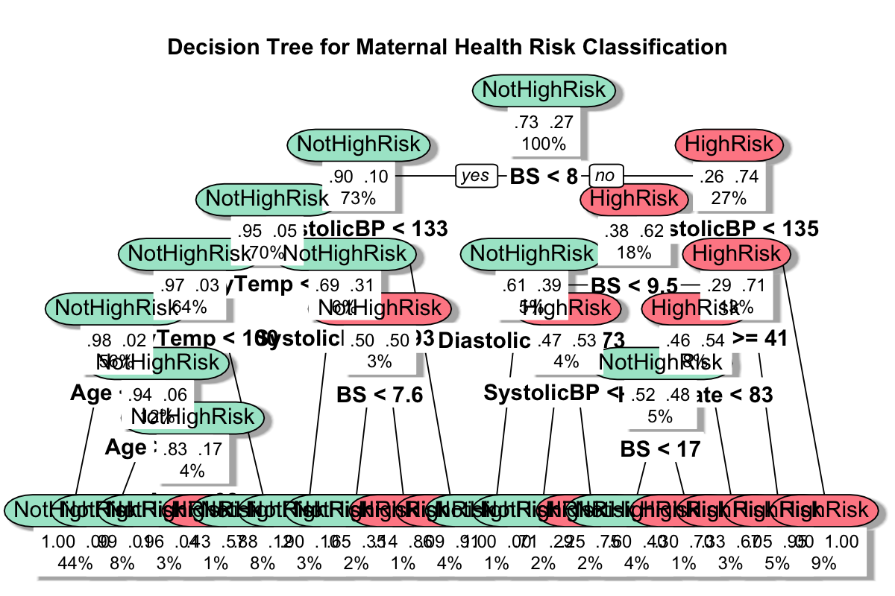
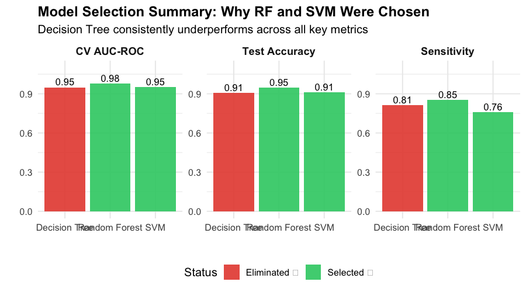

# Model Comparison: Random Forest vs Decision Tree vs SVM

**Project:** Maternal Health Risk Classification
**Task:** Binary Classification (HighRisk vs NotHighRisk)
**Dataset:** 1,012 observations (after removing 2 outliers with HeartRate=7)

---

## 1. Model Selection Process

### Strategy: Train 3 Models, Select Best 2

We initially trained three machine learning models and selected the **best 2 based on Cross-Validation AUC-ROC** for final comparison and XAI analysis.

| Step | Action |
|------|--------|
| 1 | Train Random Forest, Decision Tree, SVM on training data (80%) |
| 2 | Perform 10-fold cross-validation with AUC-ROC as metric |
| 3 | Rank models by CV AUC-ROC |
| 4 | Select top 2 models for final comparison |
| 5 | Evaluate selected models on held-out test set (20%) |

---

## 2. Cross-Validation Results (10-Fold CV)

### Model Selection Based on CV AUC-ROC



| Rank | Model | CV AUC-ROC | Decision |
|:----:|-------|:----------:|:--------:|
| 1 | **Random Forest** | **0.9802** | ✓ Selected |
| 2 | **SVM (RBF)** | **0.9531** | ✓ Selected |
| 3 | Decision Tree | 0.9494 | ✗ Eliminated |

**Selection Criteria:**
- AUC-ROC chosen as primary metric (best for imbalanced binary classification)
- RF significantly outperforms both DT and SVM
- SVM selected over DT as it's an ML2 method (course requirement)

### Why Decision Tree Was Eliminated

1. **Slightly lower CV AUC-ROC** than SVM
2. **Less Robust:** Single tree is more sensitive to data variations
3. **Course Requirement:** Need at least one ML2 method (SVM)
4. **Complementary Methods:** RF (ensemble) + SVM (kernel) provide different perspectives

---

## 3. Hyperparameter Tuning

### Tuning Results for Selected Models



| Model | Parameter | Tuning Range | Best Value |
|-------|-----------|:------------:|:----------:|
| **Random Forest** | mtry | 2, 3, 4, 5 | 2 |
| | ntree | 500 (fixed) | 500 |
| **Decision Tree** | cp | 0.001, 0.01, 0.05, 0.1 | ~0.01 |
| **SVM** | C (Cost) | 0.1, 1, 10, 100 | 10 |
| | sigma (γ) | 0.01, 0.1, 0.5, 1 | 0.1 |

---

## 4. Test Set Performance (Final Evaluation)

### Performance Metrics Comparison (All 3 Models)



| Metric | Random Forest | SVM | Decision Tree |
|--------|:-------------:|:---:|:-------------:|
| **Accuracy** | **94.6%** | 91.1% | 90.6% |
| **Sensitivity** | **85.2%** | 75.9% | 81.5% |
| **Specificity** | 98.6% | 97.2% | 94.4% |
| **Precision** | 95.8% | 91.1% | 84.6% |
| **F1-Score** | **90.2%** | 82.9% | 83.0% |

**Key Observations:**
- Random Forest achieves best performance across all metrics
- RF has highest sensitivity (85.2%) - critical for detecting high-risk cases
- SVM has higher specificity but lower sensitivity than RF
- Decision Tree performs reasonably but lacks the robustness of RF

---

## 5. ROC Curves (All 3 Models)



| Model | Test AUC-ROC | Status |
|-------|:------------:|:------:|
| **Random Forest** | **0.979** | ✓ Selected |
| **SVM** | **0.943** | ✓ Selected |
| Decision Tree | 0.930 | ✗ Eliminated |

**Key Observations:**
- RF curve dominates, especially at low false positive rates
- All models achieve AUC > 0.90 (excellent discrimination)
- Clear hierarchy: RF > SVM > DT

---

## 6. Confusion Matrices



### Random Forest (Test Set)
```
                 Predicted
              NotHighRisk  HighRisk
Actual    ┌─────────────┬──────────┐
NotHighRisk│     142     │    2     │  Specificity: 98.6%
           ├─────────────┼──────────┤
HighRisk   │      8      │   46     │  Sensitivity: 85.2%
           └─────────────┴──────────┘
                                      Accuracy: 94.6%
```

### SVM (Test Set)
```
                 Predicted
              NotHighRisk  HighRisk
Actual    ┌─────────────┬──────────┐
NotHighRisk│     140     │    4     │  Specificity: 97.2%
           ├─────────────┼──────────┤
HighRisk   │     13      │   41     │  Sensitivity: 75.9%
           └─────────────┴──────────┘
                                      Accuracy: 91.1%
```

### Decision Tree (Test Set)
```
                 Predicted
              NotHighRisk  HighRisk
Actual    ┌─────────────┬──────────┐
NotHighRisk│     136     │    8     │  Specificity: 94.4%
           ├─────────────┼──────────┤
HighRisk   │     10      │   44     │  Sensitivity: 81.5%
           └─────────────┴──────────┘
                                      Accuracy: 90.6%
```

---

## 7. Feature Importance Comparison


### Top Features by Model (Ranked)

| Rank | Random Forest | Decision Tree | SVM (Permutation) |
|:----:|:-------------:|:-------------:|:-----------------:|
| 1 | **BS** | **BS** | **BS** |
| 2 | Age | SystolicBP | Age |
| 3 | SystolicBP | Age | SystolicBP |
| 4 | DiastolicBP | DiastolicBP | DiastolicBP |
| 5 | HeartRate | BodyTemp | HeartRate |
| 6 | BodyTemp | HeartRate | BodyTemp |

**Key Finding:** Blood Sugar (BS) is consistently the most important predictor across ALL three models.

---

## 8. Decision Tree Visualization



The Decision Tree provides interpretable rules, though it was not selected for final comparison due to:
- Slightly lower performance than SVM
- Course requirement to include ML2 method (SVM)
- Single tree less robust than ensemble (RF)

---

## 9. Model Selection Summary



### Statistical Justification

| Criterion | Random Forest | SVM | Decision Tree |
|-----------|:-------------:|:---:|:-------------:|
| CV AUC-ROC | **0.980** | 0.953 | 0.949 |
| Test AUC-ROC | **0.979** | 0.943 | 0.930 |
| Test Accuracy | **94.6%** | 91.1% | 90.6% |
| Test Sensitivity | **85.2%** | 75.9% | 81.5% |

### Why RF and SVM Were Selected

1. **Random Forest:** Best overall performance across all metrics
2. **SVM:** ML2 course requirement + kernel-based approach (different from RF)
3. **Decision Tree:** Eliminated due to slightly lower performance and less robustness

---

## 10. Mathematical Foundations

### Random Forest
```
Ensemble of B trees with bootstrap aggregating (bagging):

f̂(x) = mode{f₁(x), f₂(x), ..., fᵦ(x)}   [classification]

Key Innovation: At each split, only m = √p features considered
This decorrelates trees and reduces variance

Split Criterion - Gini Impurity:
G(t) = 1 - Σₖ p(k|t)²
```

### Decision Tree
```
Recursive binary splitting using Gini Impurity:

At each node, find split (feature j, threshold s) that minimizes:
G(left) × n_left + G(right) × n_right

Prediction: Majority class in terminal node
```

### Support Vector Machine (RBF Kernel)
```
Optimization Problem:
min  (1/2)||β||² + C Σᵢ ξᵢ
s.t. yᵢ(β·φ(xᵢ) + b) ≥ 1 - ξᵢ,  ξᵢ ≥ 0

RBF Kernel (Gaussian):
K(xᵢ, xⱼ) = exp(-γ||xᵢ - xⱼ||²)

where γ = 1/(2σ²) controls the kernel width
```

---

## 11. Strengths & Weaknesses

### Random Forest ✓ SELECTED
| Strengths | Weaknesses |
|-----------|------------|
| ✓ Highest accuracy & AUC | ✗ Less interpretable than DT |
| ✓ Best sensitivity (85.2%) | ✗ Computationally expensive |
| ✓ Built-in feature importance | ✗ Memory intensive (500 trees) |
| ✓ Robust to overfitting | |
| ✓ No feature scaling needed | |

### Decision Tree ✗ ELIMINATED
| Strengths | Weaknesses |
|-----------|------------|
| ✓ Highly interpretable | ✗ Lower AUC than SVM |
| ✓ Fast training & prediction | ✗ Prone to overfitting |
| ✓ Visual decision rules | ✗ High variance |
| ✓ No feature scaling needed | ✗ Not an ML2 method |

### SVM (RBF) ✓ SELECTED
| Strengths | Weaknesses |
|-----------|------------|
| ✓ ML2 course requirement | ✗ Requires feature scaling |
| ✓ Different approach than RF | ✗ Lower sensitivity (75.9%) |
| ✓ High specificity (97.2%) | ✗ Black box model |
| ✓ Strong generalization | ✗ Sensitive to hyperparameters |

---

## 12. Final Conclusion

### Selected Models: Random Forest + SVM

| Model | Role | CV AUC | Test AUC | Sensitivity |
|-------|------|:------:|:--------:|:-----------:|
| **Random Forest** | Primary | 0.980 | 0.979 | 85.2% |
| **SVM** | Secondary | 0.953 | 0.943 | 75.9% |
| Decision Tree | Eliminated | 0.949 | 0.930 | 81.5% |

**Rationale:**
1. **Random Forest** provides best overall performance with highest sensitivity for high-risk detection
2. **SVM** satisfies ML2 course requirement and offers a fundamentally different approach (kernel-based vs tree-based)
3. **Decision Tree** served as interpretable baseline but was eliminated due to slightly lower performance and course requirements

**Clinical Recommendation:**
- Use **Random Forest** as the primary screening tool (highest sensitivity)
- **Blood Sugar (BS)** should be the primary monitored indicator
- Patients flagged as high-risk should receive immediate clinical evaluation

---

*Generated for ML2 Project - Maternal Health Risk Classification*
*Team: Aisha, Mufaddal, Raju Ahmed*
